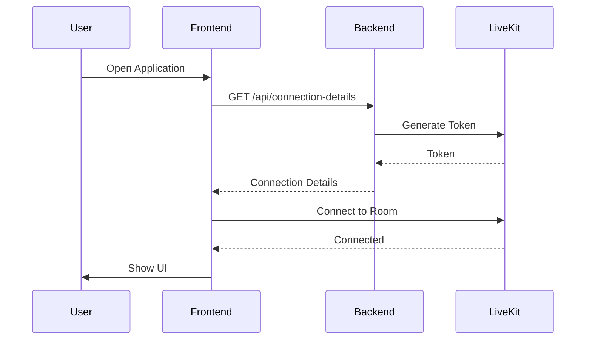
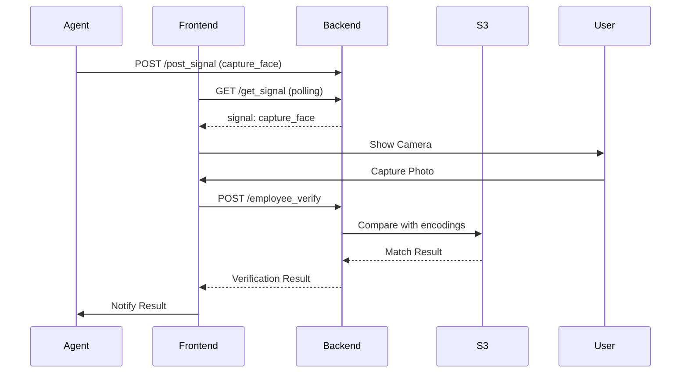
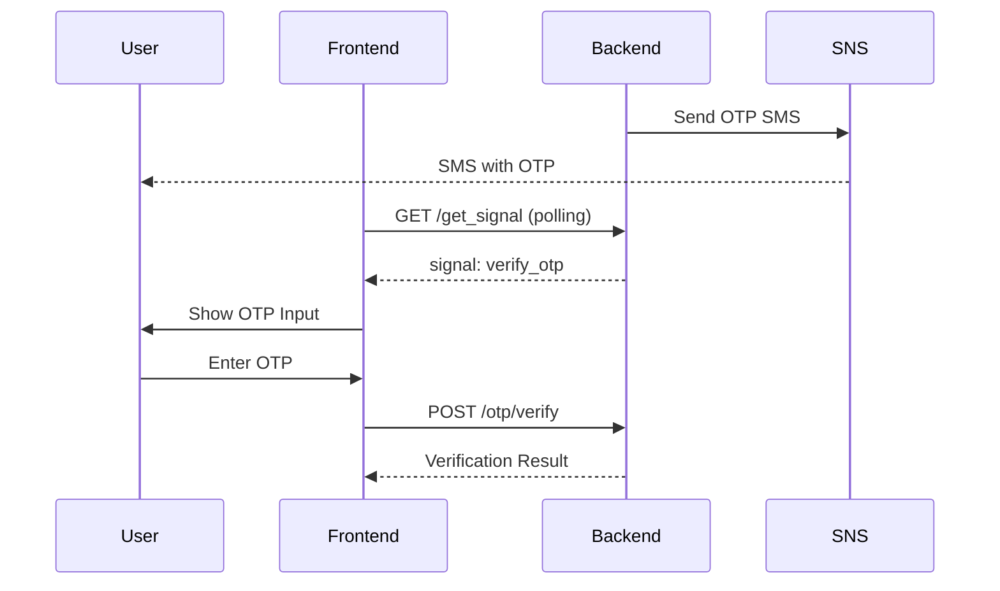

# Frontend Architecture - Clara Virtual Receptionist

## 📋 Overview

The Clara frontend is a modern, responsive web application built with **Next.js 15** and **React 19**, providing an intuitive interface for users to interact with the virtual receptionist through real-time audio/video communication.

---

## 🏗️ Architecture

### Technology Stack

- **Framework**: Next.js 15.5.2 (App Router)
- **UI Library**: React 19.0.0
- **Styling**: TailwindCSS 4 with custom animations
- **Components**: Radix UI primitives
- **Real-time**: LiveKit Client SDK 2.15.6
- **Icons**: Phosphor Icons
- **Animations**: Motion (Framer Motion), Anime.js
- **Build Tool**: Turbopack (Next.js)
- **Package Manager**: pnpm 9.15.9

### Project Structure

```
frontend/
├── app/
│   ├── (app)/
│   │   └── page.tsx              # Main application page
│   ├── api/
│   │   └── connection-details/
│   │       └── route.ts          # LiveKit token generation
│   ├── components/
│   │   ├── ChatTile.tsx          # Chat message display
│   │   └── Playground.tsx        # Main interaction component
│   ├── favicon.ico
│   ├── globals.css               # Global styles
│   └── layout.tsx                # Root layout
├── components/
│   ├── livekit/
│   │   └── AgentMultibandAudioVisualizer.tsx
│   ├── ui/                       # Shadcn UI components
│   │   ├── button.tsx
│   │   ├── label.tsx
│   │   ├── scroll-area.tsx
│   │   ├── select.tsx
│   │   ├── toggle.tsx
│   │   └── toolbar.tsx
│   ├── FaceVerifyResult.tsx      # Face verification UI
│   ├── LanguageSelector.tsx      # Language selection
│   ├── OTPVerification.tsx       # OTP input component
│   ├── VideoCapture.tsx          # Camera capture
│   ├── VisitorForm.tsx           # Visitor information form
│   └── ... (other components)
├── hooks/
│   ├── useChatAndTranscription.ts
│   ├── useConnectionDetails.ts
│   └── useDebug.ts
├── package.json
├── tailwind.config.ts
└── tsconfig.json
```

---

## 🎨 Key Components

### 1. Playground Component (`app/components/Playground.tsx`)

The main orchestrator component that manages the entire user interaction flow.

**Key Features:**
- LiveKit room connection management
- Audio/video track handling
- Chat message display and transcription
- State management for UI elements
- Integration with backend signals

**State Management:**
```typescript
const [messages, setMessages] = useState<ChatMessage[]>([]);
const [transcripts, setTranscripts] = useState<TranscriptMessage[]>([]);
const [agentState, setAgentState] = useState<string>("idle");
const [showOTPVerification, setShowOTPVerification] = useState(false);
const [showVideoCapture, setShowVideoCapture] = useState(false);
const [showVisitorForm, setShowVisitorForm] = useState(false);
```

**LiveKit Integration:**
```typescript
const room = useRoomContext();
const localParticipant = useLocalParticipant();
const agentParticipant = useAgentParticipant();
```

---

### 2. VideoCapture Component (`components/VideoCapture.tsx`)

Handles camera access and photo capture for face verification.

**Features:**
- Real-time camera preview
- Photo capture with countdown
- Automatic upload to backend
- Signal-based triggering from agent

**Key Methods:**
```typescript
const capturePhoto = async () => {
  const canvas = document.createElement('canvas');
  canvas.width = video.videoWidth;
  canvas.height = video.videoHeight;
  const ctx = canvas.getContext('2d');
  ctx?.drawImage(video, 0, 0);
  
  canvas.toBlob(async (blob) => {
    await uploadPhoto(blob);
  }, 'image/jpeg', 0.95);
};
```

**Signal Handling:**
```typescript
const checkSignal = async () => {
  const response = await fetch(`${backendUrl}/get_signal?session_id=${sessionId}`);
  const data = await response.json();
  
  if (data.signal === 'capture_face') {
    setShowCamera(true);
  }
};
```

---

### 3. OTPVerification Component (`components/OTPVerification.tsx`)

Manages OTP input and verification flow.

**Features:**
- 6-digit OTP input with auto-focus
- Paste support for OTP codes
- Automatic verification on complete input
- Error handling and retry logic

**Implementation:**
```typescript
const handleOTPChange = (index: number, value: string) => {
  if (value.length > 1) {
    // Handle paste
    const otpArray = value.slice(0, 6).split('');
    setOtp(otpArray);
    if (otpArray.length === 6) {
      verifyOTP(otpArray.join(''));
    }
  } else {
    // Handle single digit
    const newOtp = [...otp];
    newOtp[index] = value;
    setOtp(newOtp);
    
    if (value && index < 5) {
      inputRefs.current[index + 1]?.focus();
    }
  }
};
```

---

### 4. VisitorForm Component (`components/VisitorForm.tsx`)

Collects visitor information during the registration flow.

**Fields:**
- Full Name
- Company Name
- Purpose of Visit
- Host Employee Name
- Contact Number

**Validation:**
```typescript
const validateForm = () => {
  const errors: Record<string, string> = {};
  
  if (!formData.name.trim()) {
    errors.name = 'Name is required';
  }
  
  if (!formData.phone.trim()) {
    errors.phone = 'Phone number is required';
  } else if (!/^\+?[\d\s-()]+$/.test(formData.phone)) {
    errors.phone = 'Invalid phone number';
  }
  
  return errors;
};
```

---

### 5. LanguageSelector Component (`components/LanguageSelector.tsx`)

Allows users to switch between supported languages.

**Supported Languages:**
- English (en)
- Hindi (hi)
- Tamil (ta)
- Telugu (te)

**Implementation:**
```typescript
const languages = [
  { code: 'en', name: 'English', flag: '🇬🇧' },
  { code: 'hi', name: 'हिंदी', flag: '🇮🇳' },
  { code: 'ta', name: 'தமிழ்', flag: '🇮🇳' },
  { code: 'te', name: 'తెలుగు', flag: '🇮🇳' },
];

const handleLanguageChange = async (langCode: string) => {
  setSelectedLanguage(langCode);
  
  // Notify backend
  await fetch(`${backendUrl}/set_language`, {
    method: 'POST',
    headers: { 'Content-Type': 'application/json' },
    body: JSON.stringify({ language: langCode, session_id: sessionId }),
  });
};
```

---

## 🔄 Data Flow

### 1. Connection Flow



### 2. Face Verification Flow



### 3. OTP Verification Flow



---

## 🎯 Custom Hooks

### useChatAndTranscription

Manages chat messages and transcription state.

```typescript
export function useChatAndTranscription() {
  const [messages, setMessages] = useState<ChatMessage[]>([]);
  const [transcripts, setTranscripts] = useState<TranscriptMessage[]>([]);
  
  const addMessage = useCallback((message: ChatMessage) => {
    setMessages(prev => [...prev, message]);
  }, []);
  
  const addTranscript = useCallback((transcript: TranscriptMessage) => {
    setTranscripts(prev => [...prev, transcript]);
  }, []);
  
  return { messages, transcripts, addMessage, addTranscript };
}
```

### useConnectionDetails

Fetches LiveKit connection details from the backend.

```typescript
export function useConnectionDetails() {
  const [connectionDetails, setConnectionDetails] = useState<ConnectionDetails | null>(null);
  const [loading, setLoading] = useState(true);
  const [error, setError] = useState<Error | null>(null);
  
  useEffect(() => {
    const fetchDetails = async () => {
      try {
        const response = await fetch('/api/connection-details');
        const data = await response.json();
        setConnectionDetails(data);
      } catch (err) {
        setError(err as Error);
      } finally {
        setLoading(false);
      }
    };
    
    fetchDetails();
  }, []);
  
  return { connectionDetails, loading, error };
}
```

---

## 🎨 Styling

### TailwindCSS Configuration

```typescript
// tailwind.config.ts
export default {
  darkMode: ['class'],
  content: [
    './app/**/*.{js,ts,jsx,tsx,mdx}',
    './components/**/*.{js,ts,jsx,tsx,mdx}',
  ],
  theme: {
    extend: {
      colors: {
        background: 'hsl(var(--background))',
        foreground: 'hsl(var(--foreground))',
        primary: {
          DEFAULT: 'hsl(var(--primary))',
          foreground: 'hsl(var(--primary-foreground))',
        },
      },
      animation: {
        'pulse-slow': 'pulse 3s cubic-bezier(0.4, 0, 0.6, 1) infinite',
      },
    },
  },
  plugins: [require('tw-animate-css')],
};
```

### Global Styles

```css
/* app/globals.css */
@tailwind base;
@tailwind components;
@tailwind utilities;

@layer base {
  :root {
    --background: 0 0% 100%;
    --foreground: 222.2 84% 4.9%;
    --primary: 221.2 83.2% 53.3%;
  }
  
  .dark {
    --background: 222.2 84% 4.9%;
    --foreground: 210 40% 98%;
    --primary: 217.2 91.2% 59.8%;
  }
}
```

---

## 🔧 Configuration

### Environment Variables

```env
# .env.local
NEXT_PUBLIC_LIVEKIT_URL=wss://your-livekit-instance.livekit.cloud
NEXT_PUBLIC_BACKEND_URL=http://localhost:8000
NEXT_PUBLIC_CONN_DETAILS_ENDPOINT=http://localhost:8000/token
```

### Next.js Configuration

```typescript
// next.config.ts
const nextConfig = {
  output: 'export',
  images: {
    unoptimized: true,
  },
  experimental: {
    turbo: {
      rules: {
        '*.svg': {
          loaders: ['@svgr/webpack'],
          as: '*.js',
        },
      },
    },
  },
};

export default nextConfig;
```

---

## 📦 Build and Deployment

### Development

```bash
pnpm dev
# Runs on http://localhost:3000
```

### Production Build

```bash
pnpm build
# Creates optimized production build in 'out' directory
```

### Docker Build

```dockerfile
FROM node:20-alpine AS builder
WORKDIR /app
COPY package.json pnpm-lock.yaml ./
RUN npm install -g pnpm && pnpm install
COPY . .
RUN pnpm build

FROM node:20-alpine
WORKDIR /app
COPY --from=builder /app/out ./out
COPY --from=builder /app/package.json ./
RUN npm install -g serve
EXPOSE 3000
CMD ["serve", "out", "-l", "3000"]
```

---

## 🧪 Testing

### Component Testing

```typescript
// __tests__/components/OTPVerification.test.tsx
import { render, screen, fireEvent } from '@testing-library/react';
import OTPVerification from '@/components/OTPVerification';

describe('OTPVerification', () => {
  it('renders 6 input fields', () => {
    render(<OTPVerification onVerify={jest.fn()} />);
    const inputs = screen.getAllByRole('textbox');
    expect(inputs).toHaveLength(6);
  });
  
  it('calls onVerify when OTP is complete', () => {
    const onVerify = jest.fn();
    render(<OTPVerification onVerify={onVerify} />);
    
    const inputs = screen.getAllByRole('textbox');
    inputs.forEach((input, i) => {
      fireEvent.change(input, { target: { value: String(i) } });
    });
    
    expect(onVerify).toHaveBeenCalledWith('012345');
  });
});
```

---

## 🚀 Performance Optimizations

1. **Code Splitting**: Automatic route-based code splitting with Next.js
2. **Image Optimization**: Next.js Image component for optimized images
3. **Lazy Loading**: Dynamic imports for heavy components
4. **Memoization**: React.memo and useMemo for expensive computations
5. **Turbopack**: Fast development builds with Turbopack

---

## 📱 Responsive Design

The frontend is fully responsive with breakpoints:

- **Mobile**: < 640px
- **Tablet**: 640px - 1024px
- **Desktop**: > 1024px

```typescript
// Responsive example
<div className="
  flex flex-col 
  md:flex-row 
  lg:grid lg:grid-cols-3 
  gap-4
">
  {/* Content */}
</div>
```

---

## 🔐 Security Considerations

1. **Environment Variables**: Sensitive data in `.env.local` (not committed)
2. **CORS**: Configured in backend to allow only trusted origins
3. **Token Validation**: LiveKit tokens validated on backend
4. **Input Sanitization**: All user inputs sanitized before submission
5. **CSP Headers**: Content Security Policy configured in Next.js

---

## 📚 Additional Resources

- [Next.js Documentation](https://nextjs.org/docs)
- [LiveKit Client SDK](https://docs.livekit.io/client-sdk-js/)
- [TailwindCSS](https://tailwindcss.com/docs)
- [Radix UI](https://www.radix-ui.com/)

---

**Next**: Read [02-BACKEND.md](./02-BACKEND.md) to understand the backend architecture.
