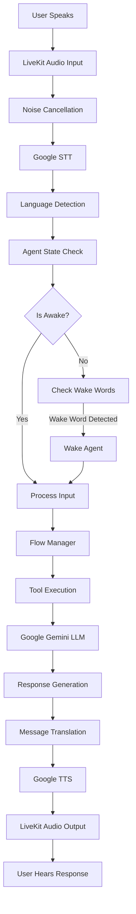

# LiveKit Agent - Clara Virtual Receptionist

## 📋 Overview

The Clara agent is a **LiveKit-based conversational AI** that provides real-time voice interactions using Google's Gemini 2.0 Flash model with speech-to-text and text-to-speech capabilities.

---

## 🏗️ Architecture

### Technology Stack

- **Framework**: LiveKit Agents SDK
- **LLM**: Google Gemini 2.0 Flash (Realtime Model)
- **STT**: Google Speech-to-Text (Chirp 2)
- **TTS**: Google Text-to-Speech
- **Plugins**: 
  - `livekit.plugins.google` - Google AI integration
  - `livekit.plugins.noise_cancellation` - Krisp noise cancellation
- **Language Detection**: FastText (lid.176.ftz)

### Agent Flow



---

## 🎯 Core Components

### 1. Agent Initialization (`agent.py`)

**Main Entry Point:**

```python
async def entrypoint(ctx: JobContext):
    """Main agent entry point"""
    logger.info(f"Starting agent for room: {ctx.room.name}")
    
    # Initialize agent session
    session = AgentSession(
        llm=google.realtime.RealtimeModel(
            model="gemini-2.0-flash-exp",
            voice="Puck",
            temperature=0.8,
            instructions=get_agent_instructions(),
        ),
        stt=google.STT(
            languages=["en-US", "hi-IN", "ta-IN", "te-IN"],
            model="chirp_2"
        ),
        tts=google.TTS(
            voice="en-US-Neural2-F",
            language_code="en-US"
        ),
        room_input_options=RoomInputOptions(
            noise_cancellation=noise_cancellation.NoiseCancellation()
        )
    )
    
    # Register function tools
    session.register_function_tool(get_company_information)
    session.register_function_tool(search_employee)
    session.register_function_tool(verify_employee_credentials)
    session.register_function_tool(register_visitor)
    session.register_function_tool(search_web)
    
    # Start agent
    agent = Agent(session)
    await agent.start(ctx.room)
    
    logger.info("Agent started successfully")
```

---

### 2. Agent Instructions (`prompts.py`)

**System Prompt:**

```python
def get_agent_instructions() -> str:
    """Get agent system instructions"""
    lang = get_preferred_language()
    
    base_instructions = """
    You are Clara, a professional and friendly virtual receptionist for Info Services.
    
    CORE RESPONSIBILITIES:
    1. Greet visitors warmly and professionally
    2. Verify employee identity through face recognition or credentials
    3. Register new visitors and collect necessary information
    4. Provide company information when asked
    5. Assist with general queries about the company
    
    CONVERSATION FLOW:
    1. Initial Greeting: Welcome the user and ask how you can help
    2. User Classification: Determine if they are an employee, visitor, or candidate
    3. Verification: For employees, initiate face recognition or credential check
    4. Visitor Registration: For visitors, collect name, company, purpose, and host
    5. Completion: Confirm actions and provide next steps
    
    LANGUAGE SUPPORT:
    - You can communicate in English, Hindi, Tamil, and Telugu
    - Automatically detect and respond in the user's preferred language
    - If asked to switch languages, do so immediately
    
    PERSONALITY:
    - Professional yet warm and approachable
    - Patient and helpful
    - Clear and concise in communication
    - Proactive in offering assistance
    
    IMPORTANT RULES:
    - Always maintain user privacy and confidentiality
    - Never share sensitive employee or visitor information
    - If you don't know something, admit it and offer to help find the answer
    - For complex queries, suggest contacting the appropriate department
    - Keep responses concise (2-3 sentences maximum)
    
    AVAILABLE TOOLS:
    - get_company_information(): Get information about Info Services
    - search_employee(name): Search for employee by name
    - verify_employee_credentials(employee_id): Verify employee credentials
    - register_visitor(visitor_data): Register a new visitor
    - search_web(query): Search the web for information
    """
    
    # Add language-specific greeting
    greetings = {
        "en": "Start every new conversation with: 'Hello! I'm Clara, your virtual receptionist. How may I help you today?'",
        "hi": "हर नई बातचीत की शुरुआत करें: 'नमस्ते! मैं क्लारा हूं, आपकी वर्चुअल रिसेप्शनिस्ट। मैं आपकी कैसे मदद कर सकती हूं?'",
        "ta": "ஒவ்வொரு புதிய உரையாடலையும் தொடங்குங்கள்: 'வணக்கம்! நான் கிளாரா, உங்கள் மெய்நிகர் வரவேற்பாளர். நான் உங்களுக்கு எப்படி உதவ முடியும்?'",
        "te": "ప్రతి కొత్త సంభాషణను ప్రారంభించండి: 'నమస్కారం! నేను క్లారా, మీ వర్చువల్ రిసెప్షనిస్ట్. నేను మీకు ఎలా సహాయం చేయగలను?'"
    }
    
    return base_instructions + "\n\n" + greetings.get(lang, greetings["en"])
```

---

### 3. Wake Word Detection

**Implementation:**

```python
WAKE_WORDS = [
    "clara", "hey clara", "hi clara", "hello clara",
    "क्लारा", "हे क्लारा", "हाय क्लारा",
    "கிளாரா", "ஹாய் கிளாரா",
    "క్లారా", "హాయ్ క్లారా"
]

def check_wake_word(text: str) -> bool:
    """Check if input contains wake word"""
    text_lower = text.lower().strip()
    
    for wake_word in WAKE_WORDS:
        if wake_word in text_lower:
            return True
    
    return False

async def process_input(text: str, session_id: str) -> dict:
    """Process user input and manage wake state"""
    global agent_state
    
    # Check for wake word if agent is asleep
    if not agent_state.is_awake:
        if check_wake_word(text):
            agent_state.wake_up(session_id)
            lang = detect_language(text)
            agent_state.language = lang
            return {
                "should_respond": True,
                "message": get_message("wake_prompt", lang)
            }
        else:
            return {"should_respond": False}
    
    # Update activity if awake
    agent_state.update_activity()
    
    # Detect language
    detected_lang = detect_language(text)
    if detected_lang != agent_state.language:
        agent_state.language = detected_lang
        save_agent_state()
    
    return {"should_respond": True}
```

---

### 4. Language Detection

**FastText Integration:**

```python
import fasttext

# Load language detection model
LANGUAGE_MODEL_PATH = "Language_model/lid.176.ftz"
lang_model = fasttext.load_model(LANGUAGE_MODEL_PATH)

def detect_language(text: str) -> str:
    """Detect language of input text"""
    try:
        # Clean text
        text = text.strip().lower()
        
        if not text:
            return "en"
        
        # Predict language
        predictions = lang_model.predict(text, k=1)
        lang_code = predictions[0][0].replace("__label__", "")
        
        # Map to supported languages
        lang_map = {
            "en": "en",
            "hi": "hi",
            "ta": "ta",
            "te": "te",
            "eng": "en",
            "hin": "hi",
            "tam": "ta",
            "tel": "te"
        }
        
        detected = lang_map.get(lang_code, "en")
        logger.info(f"Detected language: {detected} for text: {text[:50]}")
        
        return detected
        
    except Exception as e:
        logger.error(f"Language detection error: {e}")
        return "en"
```

---

### 5. Function Tools

#### Company Information Tool

```python
@function_tool
async def get_company_information(query: str = "") -> str:
    """
    Get information about Info Services company.
    
    Args:
        query: Specific query about the company (e.g., "services", "contact", "about")
    
    Returns:
        Company information as string
    """
    try:
        logger.info(f"Getting company information for query: {query}")
        
        # Try to get from S3 PDF
        info = await company_info.get_company_info_from_pdf(query)
        
        if info:
            return info
        
        # Fallback to web search
        search_query = f"Info Services company {query}" if query else "Info Services company information"
        web_results = await web_search.search_web(search_query)
        
        if web_results:
            return web_results
        
        # Final fallback
        return get_message("company_info_unavailable", get_preferred_language())
        
    except Exception as e:
        logger.error(f"Company info tool error: {e}")
        return "I'm having trouble accessing company information right now."
```

#### Employee Search Tool

```python
@function_tool
async def search_employee(name: str) -> str:
    """
    Search for an employee by name.
    
    Args:
        name: Employee name to search for
    
    Returns:
        Employee information or not found message
    """
    try:
        logger.info(f"Searching for employee: {name}")
        
        # Search in DynamoDB
        employees = employee_verification.search_employee_by_name(name)
        
        if not employees:
            return f"I couldn't find any employee named {name}. Could you please verify the name?"
        
        if len(employees) == 1:
            emp = employees[0]
            return f"I found {emp['name']} from the {emp['department']} department, working as {emp['role']}."
        
        # Multiple matches
        names = ", ".join([e['name'] for e in employees[:3]])
        return f"I found multiple employees: {names}. Could you be more specific?"
        
    except Exception as e:
        logger.error(f"Employee search error: {e}")
        return "I'm having trouble searching for that employee right now."
```

#### Employee Verification Tool

```python
@function_tool
async def verify_employee_credentials(employee_id: str) -> str:
    """
    Verify employee credentials by employee ID.
    
    Args:
        employee_id: Employee ID to verify
    
    Returns:
        Verification result message
    """
    try:
        logger.info(f"Verifying employee credentials: {employee_id}")
        
        # Get employee from DynamoDB
        employee = employee_verification.get_employee_by_id(employee_id)
        
        if not employee:
            return f"I couldn't find an employee with ID {employee_id}. Please check the ID and try again."
        
        # Update flow state
        session = get_flow_session()
        if session:
            session.employee_data = employee
            session.transition_to(FlowState.EMPLOYEE_VERIFIED)
            save_session(session)
        
        lang = get_preferred_language()
        return get_message("employee_verified", lang).format(name=employee['name'])
        
    except Exception as e:
        logger.error(f"Credential verification error: {e}")
        return "I'm having trouble verifying those credentials right now."
```

#### Visitor Registration Tool

```python
@function_tool
async def register_visitor(
    name: str,
    company: str = "",
    purpose: str = "",
    host_name: str = "",
    phone: str = ""
) -> str:
    """
    Register a new visitor.
    
    Args:
        name: Visitor's full name
        company: Visitor's company name
        purpose: Purpose of visit
        host_name: Name of employee to meet
        phone: Visitor's contact number
    
    Returns:
        Registration confirmation message
    """
    try:
        logger.info(f"Registering visitor: {name}")
        
        visitor_data = {
            "name": name,
            "company": company,
            "purpose": purpose,
            "host_name": host_name,
            "phone": phone
        }
        
        # Register in backend
        result = await visitor_management.register_visitor(visitor_data)
        
        if result["success"]:
            # Update flow state
            session = get_flow_session()
            if session:
                session.visitor_data = visitor_data
                session.transition_to(FlowState.HOST_NOTIFICATION)
                save_session(session)
            
            lang = get_preferred_language()
            return get_message("visitor_registered", lang).format(
                name=name,
                host=host_name
            )
        else:
            return f"I encountered an issue registering your visit: {result['message']}"
        
    except Exception as e:
        logger.error(f"Visitor registration error: {e}")
        return "I'm having trouble registering your visit right now."
```

#### Web Search Tool

```python
@function_tool
async def search_web(query: str) -> str:
    """
    Search the web for information.
    
    Args:
        query: Search query
    
    Returns:
        Search results summary
    """
    try:
        logger.info(f"Web search: {query}")
        
        results = await web_search.search_web(query)
        
        if results:
            return results
        
        return "I couldn't find any relevant information for that query."
        
    except Exception as e:
        logger.error(f"Web search error: {e}")
        return "I'm having trouble searching right now."
```

---

### 6. Response Sanitization

**Clean and Translate Responses:**

```python
def _sanitize_response_text(text: str) -> str:
    """Sanitize and translate LLM responses"""
    if not text:
        return text
    
    lang = get_preferred_language()
    lowered = text.lower()
    
    # Replace common LLM phrases with localized messages
    replacements = (
        ("i am sorry, i am not able to understand", "language_support_affirm"),
        ("i only speak english", "language_support_affirm"),
        ("could you please speak in english", "language_support_affirm"),
        ("i am currently limited to english", "language_support_affirm"),
        ("what do you want to search for", "search_prompt"),
        ("what would you like me to search for", "search_prompt"),
    )
    
    for phrase, message_key in replacements:
        if phrase in lowered:
            return get_message(message_key, lang)
    
    # Check for language limitation phrases
    if "i am sorry" in lowered and any(
        phrase in lowered for phrase in [
            "don't support", "do not support",
            "don't speak", "do not speak",
            "cannot speak", "can't speak"
        ]
    ):
        return get_message("language_support_affirm", lang)
    
    return text
```

---

### 7. State-based Fallback Responses

**Context-aware Fallback:**

```python
def _get_state_fallback(session, lang: str, include_default: bool = True) -> str | None:
    """Get fallback response based on current flow state"""
    
    fallback_by_state = {
        FlowState.USER_CLASSIFICATION: get_message("wake_prompt", lang),
        FlowState.FACE_RECOGNITION: get_message("flow_face_recognition_prompt", lang),
        FlowState.MANUAL_VERIFICATION: get_message("flow_manual_verification_prompt", lang),
        FlowState.CREDENTIAL_CHECK: get_message("flow_credential_check_prompt", lang),
        FlowState.FACE_REGISTRATION: get_message("flow_face_registration_prompt", lang),
        FlowState.EMPLOYEE_VERIFIED: get_message("flow_employee_verified_prompt", lang),
        FlowState.VISITOR_INFO_COLLECTION: get_message("flow_visitor_info_prompt", lang),
        FlowState.VISITOR_FACE_CAPTURE: get_message("flow_visitor_face_capture_prompt", lang),
        FlowState.HOST_NOTIFICATION: get_message("flow_host_notification_prompt", lang),
        FlowState.FLOW_END: get_message("flow_end_prompt", lang),
    }
    
    if session and session.current_state in fallback_by_state:
        fallback = fallback_by_state[session.current_state]
        if fallback:
            return _sanitize_response_text(fallback)
    
    if include_default:
        return get_message("language_support_affirm", lang)
    
    return None
```

---

### 8. Auto-sleep Management

**Automatic Sleep After Inactivity:**

```python
async def check_auto_sleep_task():
    """Background task to check for auto-sleep"""
    while True:
        try:
            if agent_state.is_awake:
                if agent_state.check_auto_sleep():
                    logger.info("Agent auto-slept due to inactivity")
                    
                    # Clear flow session
                    if agent_state.session_id:
                        clear_session(agent_state.session_id)
            
            await asyncio.sleep(10)  # Check every 10 seconds
            
        except Exception as e:
            logger.error(f"Auto-sleep check error: {e}")
            await asyncio.sleep(10)
```

---

## 🔧 Configuration

### Environment Variables

```python
# LiveKit Configuration
LIVEKIT_URL = os.getenv("LIVEKIT_URL")
LIVEKIT_API_KEY = os.getenv("LIVEKIT_API_KEY")
LIVEKIT_API_SECRET = os.getenv("LIVEKIT_API_SECRET")

# Google API
GOOGLE_API_KEY = os.getenv("GOOGLE_API_KEY")

# AWS Configuration
AWS_REGION = os.getenv("AWS_REGION", "us-east-1")
EMPLOYEE_TABLE_NAME = os.getenv("EMPLOYEE_TABLE_NAME")
VISITOR_LOG_TABLE_NAME = os.getenv("VISITOR_LOG_TABLE_NAME")

# S3 Buckets
FACE_S3_BUCKET = os.getenv("FACE_S3_BUCKET")
FACE_ENCODING_S3_KEY = os.getenv("FACE_ENCODING_S3_KEY")
COMPANY_INFO_S3_BUCKET = os.getenv("COMPANY_INFO_S3_BUCKET")
COMPANY_INFO_S3_KEY = os.getenv("COMPANY_INFO_S3_KEY")
```

### Worker Options

```python
if __name__ == "__main__":
    cli.run_app(
        WorkerOptions(
            entrypoint_fnc=entrypoint,
            worker_type=WorkerType.ROOM,
            api_key=LIVEKIT_API_KEY,
            api_secret=LIVEKIT_API_SECRET,
            ws_url=LIVEKIT_URL,
        )
    )
```

---

## 🚀 Running the Agent

### Development Mode

```bash
# Activate virtual environment
.\venv\Scripts\activate

# Run in development mode
python main.py dev
```

### Console Mode (Testing)

```bash
# Run in console mode for testing
python main.py console
```

### Production Mode

```bash
# Run as worker
python main.py start
```

---

## 📊 Logging

**Structured Logging:**

```python
import logging

# Configure logging
logging.basicConfig(
    level=logging.INFO,
    format='%(asctime)s - %(name)s - %(levelname)s - %(message)s',
    handlers=[
        logging.FileHandler('KMS/logs/agent.log'),
        logging.StreamHandler()
    ]
)

logger = logging.getLogger(__name__)

# Log examples
logger.info("Agent started successfully")
logger.warning("Face recognition confidence below threshold")
logger.error(f"Tool execution failed: {error}")
```

---

## 🐛 Error Handling

**Graceful Error Recovery:**

```python
async def safe_tool_execution(tool_func, *args, **kwargs):
    """Execute tool with error handling"""
    try:
        result = await tool_func(*args, **kwargs)
        return result
    except Exception as e:
        logger.error(f"Tool execution error: {tool_func.__name__} - {e}")
        lang = get_preferred_language()
        return get_message("tool_error", lang)

# Realtime error handling
try:
    async for event in session:
        if event.type == "error":
            logger.error(f"Realtime error: {event.error}")
            await session.say(get_message("error_occurred", get_preferred_language()))
except RealtimeError as e:
    logger.error(f"Realtime connection error: {e}")
    # Attempt reconnection
    await reconnect_session()
```

---

## 🔍 Monitoring

**Key Metrics to Track:**

1. **Agent Uptime**: Time agent stays connected
2. **Response Latency**: Time from user input to agent response
3. **Tool Execution Time**: Time taken by each function tool
4. **Language Detection Accuracy**: Percentage of correct language detections
5. **Wake Word Detection Rate**: False positives/negatives
6. **Error Rate**: Number of errors per session

---

## 🎯 Performance Optimization

### 1. Caching

```python
from functools import lru_cache

@lru_cache(maxsize=100)
def get_employee_cached(employee_id: str):
    """Cached employee lookup"""
    return get_employee_by_id(employee_id)
```

### 2. Async Operations

```python
# Parallel tool execution
async def execute_tools_parallel(tools):
    """Execute multiple tools in parallel"""
    results = await asyncio.gather(*[tool() for tool in tools])
    return results
```

### 3. Connection Pooling

```python
# Reuse boto3 sessions
session = boto3.Session()
dynamodb = session.resource('dynamodb')
s3_client = session.client('s3')
```

---

## 📚 Best Practices

1. **Keep responses concise** (2-3 sentences max)
2. **Always sanitize LLM outputs** before TTS
3. **Log all tool executions** for debugging
4. **Handle language switching** gracefully
5. **Implement proper error recovery**
6. **Use state-based fallbacks** for better UX
7. **Monitor agent health** continuously
8. **Test with real audio** in different environments

---

**Next**: Read [04-DEPLOYMENT.md](./04-DEPLOYMENT.md) for deployment instructions.
