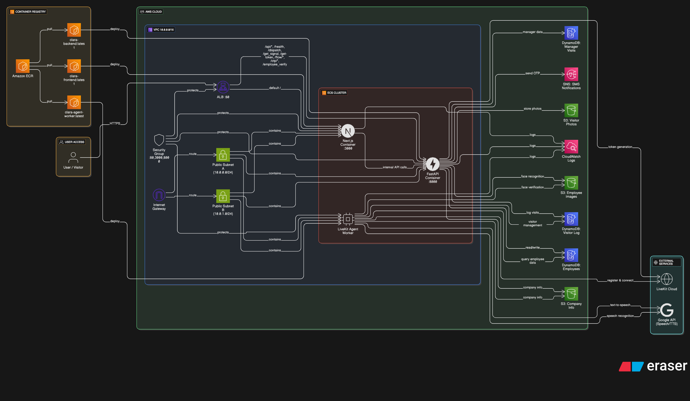

# Deployment Guide - Clara Virtual Receptionist

## 📋 Overview

Clara can be deployed using **AWS ECS Fargate** with CloudFormation or as a **Serverless** application using AWS Lambda and API Gateway.

---

## 🏗️ Deployment Architecture



---

## 🚀 ECS Fargate Deployment

### Prerequisites

1. **AWS CLI** configured with appropriate credentials
2. **Docker** installed for building images
3. **ECR repositories** created for each service
4. **LiveKit Cloud** account with API keys
5. **Google Cloud** API key for STT/TTS

### Step 1: Build and Push Docker Images

#### Backend Image

```bash
# Navigate to backend directory
cd backend

# Build Docker image
docker build -t clara-backend:latest .

# Tag for ECR
docker tag clara-backend:latest 339713066436.dkr.ecr.us-east-1.amazonaws.com/clara-backend:latest

# Login to ECR
aws ecr get-login-password --region us-east-1 | docker login --username AWS --password-stdin 339713066436.dkr.ecr.us-east-1.amazonaws.com

# Push to ECR
docker push 339713066436.dkr.ecr.us-east-1.amazonaws.com/clara-backend:latest
```

#### Frontend Image

```bash
# Navigate to frontend directory
cd frontend

# Build Docker image
docker build -t clara-frontend:latest .

# Tag and push
docker tag clara-frontend:latest 339713066436.dkr.ecr.us-east-1.amazonaws.com/clara-frontend:latest
docker push 339713066436.dkr.ecr.us-east-1.amazonaws.com/clara-frontend:latest
```

#### Agent Worker Image

```bash
# Navigate to backend directory (agent is part of backend)
cd backend

# Build agent image
docker build -f Dockerfile.agent -t clara-agent-worker:latest .

# Tag and push
docker tag clara-agent-worker:latest 339713066436.dkr.ecr.us-east-1.amazonaws.com/clara-agent-worker:latest
docker push 339713066436.dkr.ecr.us-east-1.amazonaws.com/clara-agent-worker:latest
```

### Step 2: Deploy CloudFormation Stack

```bash
# Deploy the stack
aws cloudformation deploy \
  --template-file template.yml \
  --stack-name clara-dev \
  --parameter-overrides \
    Stage=dev \
    LivekitURL=wss://your-instance.livekit.cloud \
    LivekitAPIKey=YOUR_API_KEY \
    LivekitAPISecret=YOUR_API_SECRET \
    GoogleAPIKey=YOUR_GOOGLE_API_KEY \
    BackendImageUri=339713066436.dkr.ecr.us-east-1.amazonaws.com/clara-backend:latest \
    FrontendImageUri=339713066436.dkr.ecr.us-east-1.amazonaws.com/clara-frontend:latest \
    AgentWorkerImageUri=339713066436.dkr.ecr.us-east-1.amazonaws.com/clara-agent-worker:latest \
  --capabilities CAPABILITY_IAM \
  --region us-east-1
```

### Step 3: Verify Deployment

```bash
# Get stack outputs
aws cloudformation describe-stacks \
  --stack-name clara-dev \
  --query 'Stacks[0].Outputs' \
  --output table

# Check ECS services
aws ecs list-services --cluster clara-ecs-cluster-dev

# Check service status
aws ecs describe-services \
  --cluster clara-ecs-cluster-dev \
  --services clara-backend-svc-dev clara-frontend-svc-dev clara-agent-svc-dev
```

### Step 4: Access Application

```bash
# Get ALB DNS name
ALB_DNS=$(aws cloudformation describe-stacks \
  --stack-name clara-dev \
  --query 'Stacks[0].Outputs[?OutputKey==`LoadBalancerDNS`].OutputValue' \
  --output text)

echo "Application URL: http://${ALB_DNS}"
```

---

## 📦 Serverless Deployment

### Prerequisites

1. **AWS SAM CLI** installed
2. **Docker** for building Lambda container
3. **S3 bucket** for frontend static files

### Step 1: Build Lambda Container

```bash
# Navigate to backend directory
cd backend

# Build with SAM
sam build --use-container
```

### Step 2: Deploy with SAM

```bash
# Deploy the stack
sam deploy \
  --template-file serverless.yml \
  --stack-name clara-serverless-dev \
  --parameter-overrides \
    Stage=dev \
    LiveKitApiKey=YOUR_API_KEY \
    LiveKitApiSecret=YOUR_API_SECRET \
    LiveKitUrl=wss://your-instance.livekit.cloud \
    GoogleAPIKey=YOUR_GOOGLE_API_KEY \
  --capabilities CAPABILITY_IAM \
  --resolve-s3
```

### Step 3: Deploy Frontend to S3

```bash
# Build frontend
cd frontend
pnpm build

# Sync to S3
aws s3 sync out/ s3://clara-frontend-dev/ --delete

# Create CloudFront distribution (optional)
aws cloudfront create-distribution \
  --origin-domain-name clara-frontend-dev.s3.amazonaws.com \
  --default-root-object index.html
```

---

## 🔧 Configuration Management

### Environment Variables (ECS)

Set in `template.yml` under `ContainerDefinitions.Environment`:

```yaml
Environment:
  - Name: LIVEKIT_API_KEY
    Value: !Ref LivekitAPIKey
  - Name: LIVEKIT_API_SECRET
    Value: !Ref LivekitAPISecret
  - Name: LIVEKIT_URL
    Value: !Ref LivekitURL
  - Name: GOOGLE_API_KEY
    Value: !Ref GoogleAPIKey
  - Name: AWS_REGION
    Value: !Ref AWS::Region
  - Name: EMPLOYEE_TABLE_NAME
    Value: zenith-hr-employees
  - Name: VISITOR_LOG_TABLE_NAME
    Value: Clara_visitor_log
  - Name: FACE_S3_BUCKET
    Value: clara-employee-images
  - Name: COMPANY_INFO_S3_BUCKET
    Value: clara-company-info
```

### Secrets Management (Production)

Use **AWS Secrets Manager** for sensitive data:

```yaml
# In template.yml
Secrets:
  - Name: LIVEKIT_API_SECRET
    ValueFrom: !Ref LiveKitSecretArn
  - Name: GOOGLE_API_KEY
    ValueFrom: !Ref GoogleAPIKeySecretArn
```

Create secrets:

```bash
# Create LiveKit secret
aws secretsmanager create-secret \
  --name clara/livekit-api-secret \
  --secret-string "YOUR_SECRET"

# Create Google API key secret
aws secretsmanager create-secret \
  --name clara/google-api-key \
  --secret-string "YOUR_API_KEY"
```

---

## 📊 Monitoring and Logging

### CloudWatch Logs

```bash
# View backend logs
aws logs tail /ecs/clara-dev --follow --filter-pattern "ERROR"

# View agent logs
aws logs tail /ecs/clara-dev --follow --filter-pattern "agent"

# View specific log stream
aws logs get-log-events \
  --log-group-name /ecs/clara-dev \
  --log-stream-name backend/clara-backend/task-id
```

### CloudWatch Metrics

Key metrics to monitor:

1. **ECS Service Metrics**
   - CPUUtilization
   - MemoryUtilization
   - DesiredTaskCount vs RunningTaskCount

2. **ALB Metrics**
   - TargetResponseTime
   - RequestCount
   - HTTPCode_Target_4XX_Count
   - HTTPCode_Target_5XX_Count

3. **Custom Metrics**
   - Agent wake/sleep events
   - Face recognition success rate
   - OTP verification attempts

### CloudWatch Alarms

```bash
# Create CPU alarm
aws cloudwatch put-metric-alarm \
  --alarm-name clara-backend-high-cpu \
  --alarm-description "Alert when CPU exceeds 80%" \
  --metric-name CPUUtilization \
  --namespace AWS/ECS \
  --statistic Average \
  --period 300 \
  --threshold 80 \
  --comparison-operator GreaterThanThreshold \
  --evaluation-periods 2
```

---

## 🔄 CI/CD Pipeline

### GitHub Actions Workflow

```yaml
# .github/workflows/deploy.yml
name: Deploy Clara

on:
  push:
    branches: [main]

jobs:
  deploy:
    runs-on: ubuntu-latest
    steps:
      - uses: actions/checkout@v3
      
      - name: Configure AWS credentials
        uses: aws-actions/configure-aws-credentials@v2
        with:
          aws-access-key-id: ${{ secrets.AWS_ACCESS_KEY_ID }}
          aws-secret-access-key: ${{ secrets.AWS_SECRET_ACCESS_KEY }}
          aws-region: us-east-1
      
      - name: Login to ECR
        id: login-ecr
        uses: aws-actions/amazon-ecr-login@v1
      
      - name: Build and push backend
        env:
          ECR_REGISTRY: ${{ steps.login-ecr.outputs.registry }}
          ECR_REPOSITORY: clara-backend
          IMAGE_TAG: ${{ github.sha }}
        run: |
          cd backend
          docker build -t $ECR_REGISTRY/$ECR_REPOSITORY:$IMAGE_TAG .
          docker push $ECR_REGISTRY/$ECR_REPOSITORY:$IMAGE_TAG
      
      - name: Build and push frontend
        env:
          ECR_REGISTRY: ${{ steps.login-ecr.outputs.registry }}
          ECR_REPOSITORY: clara-frontend
          IMAGE_TAG: ${{ github.sha }}
        run: |
          cd frontend
          docker build -t $ECR_REGISTRY/$ECR_REPOSITORY:$IMAGE_TAG .
          docker push $ECR_REGISTRY/$ECR_REPOSITORY:$IMAGE_TAG
      
      - name: Deploy to ECS
        run: |
          aws cloudformation deploy \
            --template-file template.yml \
            --stack-name clara-prod \
            --parameter-overrides \
              Stage=prod \
              BackendImageUri=$ECR_REGISTRY/clara-backend:$IMAGE_TAG \
              FrontendImageUri=$ECR_REGISTRY/clara-frontend:$IMAGE_TAG \
            --capabilities CAPABILITY_IAM
```

---

## 🔐 Security Best Practices

### 1. Network Security

```yaml
# Security Group Configuration
SecurityGroupIngress:
  # ALB - Allow HTTP from anywhere
  - IpProtocol: tcp
    FromPort: 80
    ToPort: 80
    CidrIp: 0.0.0.0/0
  
  # Backend - Allow only from VPC
  - IpProtocol: tcp
    FromPort: 8000
    ToPort: 8000
    CidrIp: !Ref VpcCidr
  
  # Frontend - Allow only from VPC
  - IpProtocol: tcp
    FromPort: 3000
    ToPort: 3000
    CidrIp: !Ref VpcCidr
```

### 2. IAM Roles

Principle of least privilege:

```yaml
Policies:
  - PolicyName: ClaraAppAccess
    PolicyDocument:
      Version: '2012-10-17'
      Statement:
        - Effect: Allow
          Action:
            - dynamodb:GetItem
            - dynamodb:Query
            - dynamodb:PutItem
            - dynamodb:UpdateItem
          Resource:
            - !GetAtt EmployeesTable.Arn
            - !GetAtt VisitorLogTable.Arn
        
        - Effect: Allow
          Action:
            - s3:GetObject
            - s3:PutObject
          Resource:
            - !Sub '${FaceImageBucket.Arn}/*'
            - !Sub '${VisitorPhotoBucket.Arn}/*'
        
        - Effect: Allow
          Action:
            - sns:Publish
          Resource: '*'
          Condition:
            StringEquals:
              'sns:Protocol': 'sms'
```

### 3. Encryption

- **Data at Rest**: Enable DynamoDB encryption, S3 bucket encryption
- **Data in Transit**: Use HTTPS/WSS for all communications
- **Secrets**: Store in AWS Secrets Manager with automatic rotation

---

## 📈 Scaling Configuration

### Auto Scaling for ECS Services

```yaml
# Backend Auto Scaling
BackendAutoScaling:
  Type: AWS::ApplicationAutoScaling::ScalableTarget
  Properties:
    ServiceNamespace: ecs
    ResourceId: !Sub 'service/${ClaraECSCluster}/${ClaraBackendService.Name}'
    ScalableDimension: ecs:service:DesiredCount
    MinCapacity: 1
    MaxCapacity: 10

BackendScalingPolicy:
  Type: AWS::ApplicationAutoScaling::ScalingPolicy
  Properties:
    PolicyName: BackendCPUScaling
    PolicyType: TargetTrackingScaling
    ScalingTargetId: !Ref BackendAutoScaling
    TargetTrackingScalingPolicyConfiguration:
      TargetValue: 70.0
      PredefinedMetricSpecification:
        PredefinedMetricType: ECSServiceAverageCPUUtilization
```

---

## 🔄 Update Strategy

### Rolling Updates

```yaml
DeploymentConfiguration:
  MaximumPercent: 200
  MinimumHealthyPercent: 100
  DeploymentCircuitBreaker:
    Enable: true
    Rollback: true
```

### Blue/Green Deployment

```bash
# Create new task definition
aws ecs register-task-definition --cli-input-json file://task-def-v2.json

# Update service with new task definition
aws ecs update-service \
  --cluster clara-ecs-cluster-prod \
  --service clara-backend-svc-prod \
  --task-definition clara-backend-prod:2 \
  --deployment-configuration "maximumPercent=200,minimumHealthyPercent=100"

# Monitor deployment
aws ecs wait services-stable \
  --cluster clara-ecs-cluster-prod \
  --services clara-backend-svc-prod
```

---

## 🧪 Testing Deployment

### Health Check Script

```bash
#!/bin/bash
# test-deployment.sh

ALB_DNS=$1

echo "Testing Clara deployment at $ALB_DNS"

# Test health endpoint
echo "1. Testing health endpoint..."
curl -f http://${ALB_DNS}/health || exit 1

# Test token generation
echo "2. Testing token generation..."
curl -f "http://${ALB_DNS}/get-token?room_name=test&participant_name=tester" || exit 1

# Test frontend
echo "3. Testing frontend..."
curl -f http://${ALB_DNS}/ || exit 1

echo "All tests passed!"
```

### Load Testing

```bash
# Using Apache Bench
ab -n 1000 -c 10 http://${ALB_DNS}/health

# Using Artillery
artillery quick --count 100 --num 10 http://${ALB_DNS}/
```

---

## 🐛 Troubleshooting

### Common Issues

#### 1. Agent Not Connecting to LiveKit

**Symptoms**: Agent logs show timeout errors

**Solution**:
```bash
# Check environment variables
aws ecs describe-task-definition \
  --task-definition clara-agent-dev \
  --query 'taskDefinition.containerDefinitions[0].environment'

# Verify LiveKit credentials
# Ensure GOOGLE_API_KEY is set correctly
```

#### 2. High Memory Usage

**Symptoms**: Tasks being killed due to OOM

**Solution**:
```yaml
# Increase memory in template.yml
Memory: '2048'  # Increase from 1024 to 2048
```

#### 3. Face Recognition Failing

**Symptoms**: Face verification always returns no match

**Solution**:
```bash
# Check S3 bucket access
aws s3 ls s3://clara-employee-images/Pickle_file/

# Verify IAM permissions
aws iam simulate-principal-policy \
  --policy-source-arn <task-role-arn> \
  --action-names s3:GetObject \
  --resource-arns arn:aws:s3:::clara-employee-images/*
```

---

## 📚 Deployment Checklist

- [ ] ECR repositories created
- [ ] Docker images built and pushed
- [ ] Environment variables configured
- [ ] Secrets stored in Secrets Manager
- [ ] DynamoDB tables created
- [ ] S3 buckets created with proper permissions
- [ ] LiveKit account configured
- [ ] Google API key obtained
- [ ] CloudFormation stack deployed
- [ ] Health checks passing
- [ ] Monitoring and alarms configured
- [ ] Backup strategy implemented
- [ ] Disaster recovery plan documented

---

## 🔗 Useful Commands

```bash
# View all stacks
aws cloudformation list-stacks --stack-status-filter CREATE_COMPLETE UPDATE_COMPLETE

# Update stack
aws cloudformation update-stack \
  --stack-name clara-dev \
  --template-body file://template.yml \
  --parameters file://parameters.json \
  --capabilities CAPABILITY_IAM

# Delete stack
aws cloudformation delete-stack --stack-name clara-dev

# Restart ECS service
aws ecs update-service \
  --cluster clara-ecs-cluster-dev \
  --service clara-backend-svc-dev \
  --force-new-deployment

# View task logs
aws ecs describe-tasks \
  --cluster clara-ecs-cluster-dev \
  --tasks <task-id>
```

---

**Next**: Read [05-DATABASE.md](./05-DATABASE.md) for database schema details.
